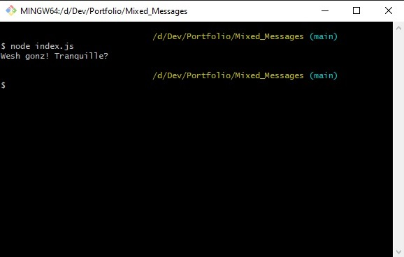

# MIXED MESSAGES
> Random messages generator

## Table of contents
* [General info](#general-info)
* [Screenshots](#screenshots)
* [Technologies](#technologies)
* [Setup](#setup)
* [Features](#features)
* [Status](#status)
* [Inspiration](#inspiration)
* [Contact](#contact)

## General info
My take at Codecademy's first portfolio project.
Training for Javascript, Markdown and Git

## Screenshots


## Technologies
* JavaScript 
* Markdown

## Setup
node index.js from bash

## Code Examples
```javascript
const messageMixer = () => {
  const firstPartResult =
    dataBase.firstPart[randNum(dataBase._firstPart.length)];
    ...
```

## Features
Working features
* Version control
* French slang greeting database
* Database switchable to any other theme via getter/setters

Possible developments:
* Change the message theme. Possible ideas: 
  * Movie plot generator, 
  * Role game quest generator

## Status
Project is: _finished_

## Inspiration
Based on Codecademy portfolio project

## Contact
Created by [@Natoof] - feel free to contact me!